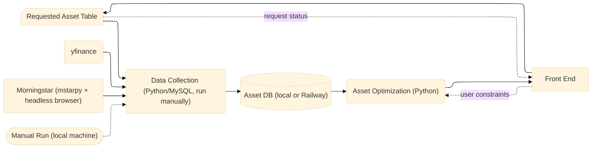
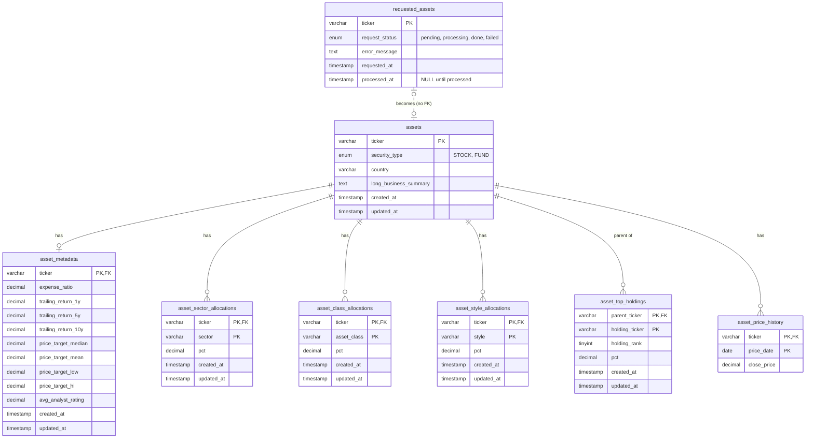

## Application Architecture

```mermaid
---
config:
  layout: elk
  theme: base
---
flowchart LR
    fe["Asset Optimization (Python)"] ---> test["Front End"]
    n1["Asset DB (local or Railway)"] --> fe
    n3["Requested Asset Table"] --> n2["Data Collection (Python/MySQL, run manually)"]
    n2 --> n1
    test --> n3
    test -. user constraints .-> fe
    n3 -. request status .-> test
    yf["yfinance"] --> n2
    ms["Morningstar (mstarpy + headless browser)"] --> n2
    manual(["Manual Run (local machine)"]) -.-> n2

    fe@{ shape: rounded}
    n1@{ shape: cyl}
    n3@{ shape: card}
    n2@{ shape: rounded}
    yf@{ shape: rounded}
    ms@{ shape: rounded}
```

## Database Architecture

```mermaid
erDiagram
    requested_assets |o..o| assets : "becomes (no FK)"
    assets ||--o| asset_metadata : has
    assets ||--o{ asset_sector_allocations : has
    assets ||--o{ asset_class_allocations : has
    assets ||--o{ asset_style_allocations : has
    assets ||--o{ asset_top_holdings : "parent of"
    assets ||--o{ asset_price_history : has

    requested_assets {
        varchar ticker PK
        enum request_status "pending, processing, done, failed"
        text error_message
        timestamp requested_at
        timestamp processed_at "NULL until processed"
    }
    assets {
        varchar ticker PK
        enum security_type "STOCK, FUND"
        varchar country
        text long_business_summary
        timestamp created_at
        timestamp updated_at
    }
    asset_metadata {
        varchar ticker PK, FK
        decimal expense_ratio
        decimal trailing_return_1y
        decimal trailing_return_5y
        decimal trailing_return_10y
        decimal price_target_median
        decimal price_target_mean
        decimal price_target_low
        decimal price_target_hi
        decimal avg_analyst_rating
        timestamp created_at
        timestamp updated_at
    }
    asset_sector_allocations {
        varchar ticker PK, FK
        varchar sector PK
        decimal pct
        timestamp created_at
        timestamp updated_at
    }
    asset_class_allocations {
        varchar ticker PK, FK
        varchar asset_class PK
        decimal pct
        timestamp created_at
        timestamp updated_at
    }
    asset_style_allocations {
        varchar ticker PK, FK
        varchar style PK
        decimal pct
        timestamp created_at
        timestamp updated_at
    }
    asset_top_holdings {
        varchar parent_ticker PK, FK
        varchar holding_ticker PK
        tinyint holding_rank
        decimal pct
        timestamp created_at
        timestamp updated_at
    }
    asset_price_history {
        varchar ticker PK, FK
        date price_date PK
        decimal close_price
    }
```